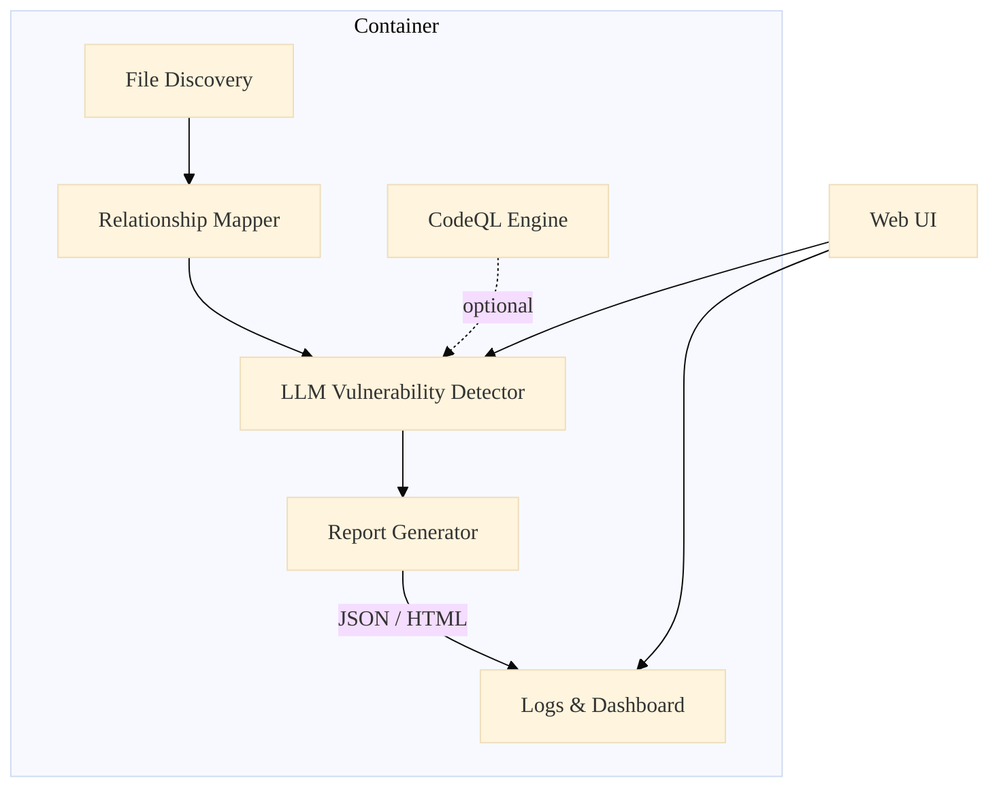

# AI_SAST · *AI‑Powered Static Application Security Testing*

> **AI_SAST** is a container‑native security scanner that combines traditional static analysis with the power of OpenAI models & GitHub CodeQL, giving you **actionable vulnerability reports** for modern frontend stacks in minutes.


---

## ✨ Key Features

|  |  |
|---|---|
| 🔍 **Smart File Discovery** | Recursively scans codebases and filters only security‑relevant files (JS/TS, JSX/TSX, HTML, CSS, JSON, configs…) |
| 🔄 **Context‑Aware Analysis** | Maps file dependencies to understand data‑flows and taint sources |
| 🤖 **AI‑Powered Detection** | Utilises GPT‑4‑Turbo (configurable) to spot complex, business‑logic vulnerabilities human scanners miss |
| 🤝 **CodeQL Fusion** | Merges findings from GitHub’s CodeQL for JavaScript, Python, Go, C/C++… into a single report |
| 📊 **Comprehensive Reports** | Outputs neatly‑structured JSON *and* renders a sleek web dashboard (Flask + HTMX) |
| 🐳 **Zero‑Friction Docker** | One‑line run, fully isolated; no local Python or Node deps required |

---

## 📚 Table of Contents

- [Quick Start](#-quick-start)
- [Configuration](#-configuration)
- [Web Interface](#-web-interface)
- [Sample Report](#-sample-report)
- [Architecture](#-architecture)
- [Roadmap](#-roadmap)
- [Contributing](#-contributing)
- [License](#-license)

---

## 🚀 Quick Start

### Requirements

* **Docker 20.10+**
* An **OpenAI API key** with usage quota

```bash
# Pull & launch the latest container (detached)
docker run -d \
  --name ai_sast \
  -p 5000:5000 \
  -e OPENAI_API_KEY="<your_openai_api_key>" \
  -v /path/to/your/code:/project:ro \
  -v /path/to/output:/logs \
  andreimoldovan2/ai_sast:latest
```

Open <http://localhost:5000> and start your first scan with **one click**.

> **Tip:** For CI pipelines, use the non‑interactive CLI entrypoint: `python /app/src/main.py` (see below).

### CLI Mode

```bash
docker run --rm \
  -e OPENAI_API_KEY="<your_openai_api_key>" \
  -v $(pwd):/project:ro \
  -v $(pwd)/ai_sast_logs:/logs \
  andreimoldovan2/ai_sast python /app/src/main.py \
  --project-name "$(basename $PWD)" \
  --batch-size 20
```

---

## ⚙️ Configuration

Either export **environment variables** or pass them via `-e` to `docker run`.

| Variable | Default | Description |
|----------|---------|-------------|
| `OPENAI_API_KEY` **/ `OPENAI_KEY`** | **required** | OpenAI secret token |
| `SRC_DIR` | `/project` | Path inside the container to scan |
| `OUTPUT_DIR` | `/logs` | Where JSON & HTML reports are placed |
| `PROJECT_NAME` | basename of `SRC_DIR` | Name displayed in UI & report filenames |
| `OPENAI_MODEL` | `gpt-4-turbo` | Any model the API key can access |
| `MAX_TOKENS` | `8192` | Per‑request token budget |
| `TEMPERATURE` | `0.2` | LLM creativity vs determinism |
| `ENABLE_CODEQL` | `true` | Toggle CodeQL stage |
| `CODEQL_LANGUAGE` | `javascript` | Primary language to feed CodeQL |
| `BATCH_SIZE` | `10` | Files processed concurrently |
| `MAX_RETRIES` | `3` | LLM call retries on failures |
| `RETRY_DELAY` | `5` | Seconds between retries |

---

## 🌐 Web Interface


The **responsive dashboard** lets you:

1. Browse historical scans (sortable by date & risk)
2. Trigger new scans on any sub‑folder of the mounted volume
3. Drill down into vulnerability details with code snippets, severity badges & remediation snippets
4. Watch live progress bars 🚀

All assets are served inside the container—no external calls, perfect for air‑gapped environments.

---

## 📄 Sample Report

<details>
<summary>Click to expand JSON example</summary>

```json
{
  "tool": "AI_SAST",
  "project": "acme‑frontend",
  "scan_date": "2025‑04‑19T13:26:44Z",
  "vulnerabilities": [
    {
      "id": "XSS‑001",
      "type": "Cross‑Site Scripting (XSS)",
      "file": "src/components/SearchBox.tsx",
      "line": 42,
      "column": 18,
      "severity": "high",
      "description": "Unsanitised user input rendered into DOM via dangerouslySetInnerHTML.",
      "remediation": "Escape or sanitize the query string before rendering, e.g. via DOMPurify."
    },
    {
      "id": "IDOR‑003",
      "type": "Insecure Direct Object Reference",
      "file": "pages/api/user/[id].ts",
      "line": 27,
      "severity": "critical",
      "description": "Endpoint fetches user records by ID without verifying ownership.",
      "remediation": "Enforce ownership check or RBAC before returning data."
    }
  ]
}
```

</details>

---

## 🏗 Architecture


